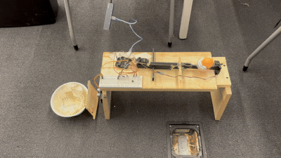
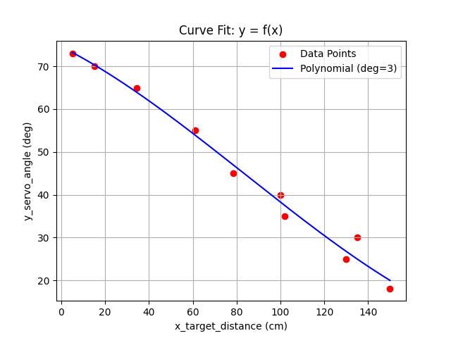

# pewpew


Automatic ranging catapult for university competition (software and firmware).

- Ontario Tech University, Internal Engineering Competition (IEC) 2025, Senior
  Design category.

---

<details markdown="1">
  <summary>Table of Contents</summary>

<!-- TOC -->
* [pewpew](#pewpew)
  * [1 Overview](#1-overview)
    * [1.1 Bill of Materials (BOM)](#11-bill-of-materials-bom)
    * [1.2 Block Diagram](#12-block-diagram)
    * [1.3 Pin Configurations](#13-pin-configurations)
  * [2 Python Code](#2-python-code)
  * [3 Arduino Code](#3-arduino-code)
<!-- TOC -->

</details>

---

## 1 Overview

<div align="center">
  <br>
    "Good enough" accuracy... lol.
</div>

### 1.1 Bill of Materials (BOM)

| Manufacturer Part Number | Manufacturer | Description             | Quantity | Notes |
|--------------------------|--------------|-------------------------|---------:|-------|
| Arduino Uno              | Generic      | MCU                     |        1 |       |
| HC-SR04                  | Generic      | Ultrasonic range finder |        1 |       |
| Hobby servo              | Generic      | Actuator                |        1 |       |
| Push button              | Generic      | Trigger                 |        1 |       |

### 1.2 Block Diagram


> Drawio file here: [pewpew.drawio](docs/pewpew.drawio).

### 1.3 Pin Configurations

<details markdown="1">
  <summary>Pin & Peripherals Table</summary>

| Arduino Uno | Peripheral    | Config | Connection                | Notes |
|-------------|---------------|--------|---------------------------|-------|
| D2          | `GPIO OUTPUT` |        | HC-SR04: `TRIG`           |       |
| D3          | `GPIO INPUT`  |        | HC-SR04: `ECHO`           |       |
| D9          | `PWM Output`  |        | Servo 1 of 2: `PWM Input` |       |
| D10         | `PWM Output`  |        | Servo 2 of 2: `PWM Input` |       |
| ???         | `GPIO INPUT`  |        | Push button               |       |

> Note: The push button was not implemented, the code would execute
> continuously.

</details>

---

## 2 Python Code

To dynamically convert a target range value into a spring-tension or angle
command, a one-dimensional linear regression (or higher-order polynomial fit) is
calibrated.

The [main.py](main.py) file can be run using a `.csv` dataset generating an
n-dimension curve fit equation, `matplotlib` graph and example `C`/`C++` Arduino
code.

The following shows example python code execution with terminal inputs based
on [data.csv](data.csv). The related example `C`/`C++` Arduino code output is
shown below:

```
##### Curve Fitting #####
Modelling: y = f(x)

Enter CSV file path (e.g., data.csv):
> data.csv

Does the CSV have a header row? (y/n)
> y

Loaded 10 data points from data.csv

Polynomial degree (1-3 recommended): 3

Fitted coefficients (highest power first):
  a_3 = 0.00000697
  a_2 = -0.00175929
  a_1 = -0.25669064
  a_0 = 74.57740974

Polynomial form (y):
  y ~= 0.00000697 * pow(x, 3) + -0.00175929 * pow(x, 2) + -0.25669064 * x + 74.57740974

##### Arduino function (copy-paste) #####

float y_from_x(float x) {
    // Polynomial approximation generated from Python.
    float y = 0.00000697f * x * x * x + -0.00175929f * x * x + -0.25669064f * x + 74.57740974f;
    return y;
}

// Call y_from_x(x).
```

Additionally, the following plot is created showing the datapoints and fit
curve.

<div align="center">
  
</div>

---

## 3 Arduino Code

The final implemented Arduino code applying the curve fit automatic ranging can
be found in [pewpew_uno.ino](pewpew_uno/pewpew_uno.ino).
