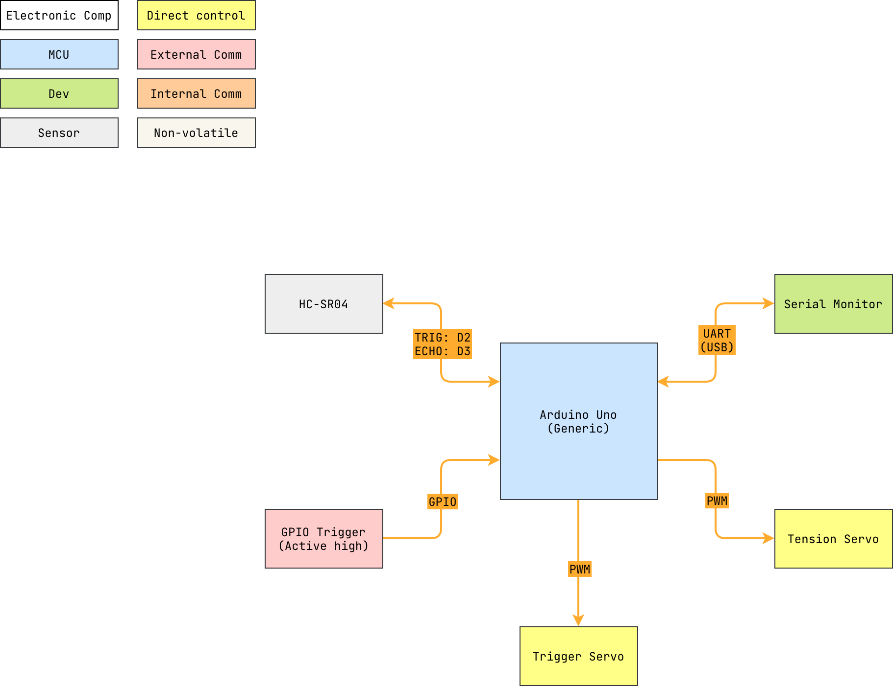

# pewpew

---

  
Table of Contents

<!-- TOC -->
* [pewpew](#pewpew)
  * [1 Overview](#1-overview)
    * [1.1 Bill of Materials (BOM)](#11-bill-of-materials-bom)
    * [1.2 Block Diagram](#12-block-diagram)
<!-- TOC -->

---

## 1 Overview

### 1.1 Bill of Materials (BOM)

| Manufacturer Part Number | Manufacturer | Description             | Quantity | Notes |
|--------------------------|--------------|-------------------------|---------:|-------|
| Arduino Uno              | Generic      | MCU                     |        1 |       |
| HC-SR04                  | Generic      | Ultrasonic range finder |        1 |       |
| Hobby servo              | Generic      | Actuator                |        1 |       |
| Push button              | Generic      | Trigger                 |        1 |       |

### 1.2 Block Diagram

> Drawio file here: [pewpew.drawio](docs/pewpew.drawio).
